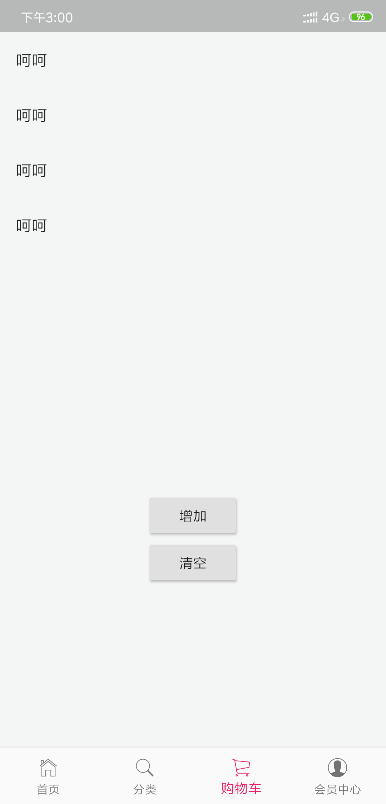

# shared_preferences



退出软件后再次打开软件,数据依旧还在

```dart
import 'package:flutter/material.dart';
import 'package:shared_preferences/shared_preferences.dart';

class CarPage extends StatefulWidget {
  @override
  _CarPageState createState() => _CarPageState();
}

class _CarPageState extends State<CarPage> {
  List<String> testList = [];

  @override
  Widget build(BuildContext context) {
    _show();
    return Container(
      child: Column(
        children: <Widget>[
          Container(
            height: 500,
            child: ListView.builder(
              itemCount: testList.length,
              itemBuilder: (context, index) {
                return ListTile(
                  title: Text(testList[index]),
                );
              },
            ),
          ),
          RaisedButton(
            onPressed: () {
              _add();
            },
            child: Text('增加'),
          ),
          RaisedButton(
            onPressed: () {
              _clear();
            },
            child: Text('清空'),
          ),
        ],
      ),
    );
  }

//  增加方法
  void _add() async {
    SharedPreferences prefs = await SharedPreferences.getInstance();
    String temp = '呵呵';
    testList.add(temp);
    prefs.setStringList('testInfo', testList);
    _show();
  }

//  查询
  void _show() async {
    SharedPreferences prefs = await SharedPreferences.getInstance();
    if (prefs.getStringList('testInfo') != null) {
      setState(() {
        testList = prefs.getStringList('testInfo');
      });
    }
  }

//  删除
  void _clear() async {
    SharedPreferences prefs = await SharedPreferences.getInstance();
//    全部删除
//    prefs.clear();
    prefs.remove('testInfo');
    setState(() {
      testList = [];
    });
  }
}

```

 <Vssue title="shared_preferences" />
