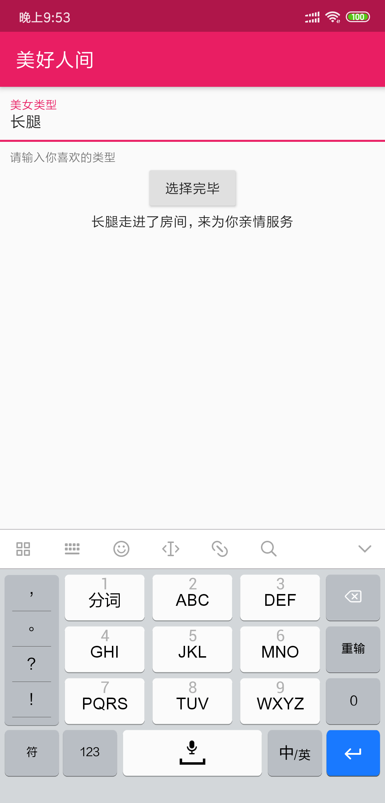

# Dio
:::tip
dio是一个强大的Dart Http请求库，支持Restful API、FormData、拦截器、请求取消、Cookie管理、文件上传/下载、超时、自定义适配器等...
:::

## 添加依赖
```dart
dependencies:
  dio: ^2.1.x
```
## 一个极简的示例
```dart
import 'package:dio/dio.dart';
void getHttp() async {
  try {
    Response response = await Dio().get("http://www.baidu.com");
    print(response);
  } catch (e) {
    print(e);
  }
}
```

## flutter get请求
```dart {62,63,64,65,66,67,68,69,70,71,72,73,74}
import 'package:flutter/material.dart';
import 'package:dio/dio.dart';
class HomePage extends StatefulWidget {
  @override
  _HomePageState createState() => _HomePageState();
}

class _HomePageState extends State<HomePage> {
  TextEditingController typeController=TextEditingController();
  String showText="欢迎你来到这里!";
  @override
  Widget build(BuildContext context) {
    return Container(
      child: Scaffold(
        appBar: AppBar(
          title: Text("美好人间"),
        ),
        body: Container(
          child: Column(
            children: <Widget>[
              TextField(
                controller: typeController,
                decoration: InputDecoration(
                  contentPadding: EdgeInsets.all(10.0),
                  labelText: "美女类型",
                  helperText: '请输入你喜欢的类型'
                ),
                autofocus: false,
              ),
              RaisedButton(
                onPressed: _choiceAction,
                child: Text("选择完毕"),
              ),
              Text(
                showText,
                overflow: TextOverflow.ellipsis,
                maxLines: 1,
              )
            ],
          ),
        ),
      ),
    );
  }

  void _choiceAction(){
    print("开始选择");
    if(typeController.text.toString()==''){
      showDialog(
        context: context,
        builder: (context)=>AlertDialog(title:Text("美女类型不能为空"))
      );
    }else{
      getHttp(typeController.text.toString()).then((val){
        setState(() {
          showText=val['data']['name'].toString();
        });
      });
    }
  }

  Future getHttp(String TypeText) async{
     try {
      Response response;
      var data={"name":TypeText};
      response = await Dio().get(
          "https://www.easy-mock.com/mock/5c60131a4bed3a6342711498/baixing/dabaojian",
          queryParameters: data
          );
      return response.data;
    } catch (e) {
      return print(e);
    }
  }
}
```
> 效果如下



 <Vssue title="dio" />