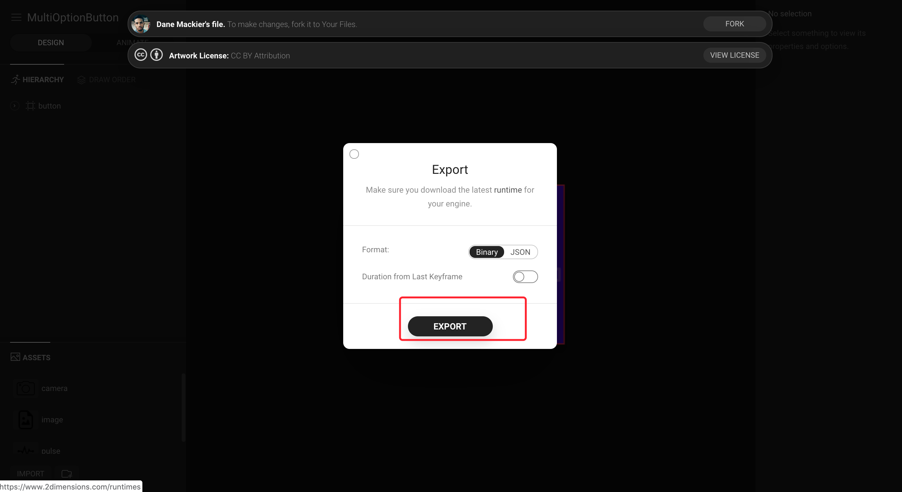

# Flare 动画


如上:

- 1.我们需要用的是 [flare](https://www.2dimensions.com/) 官网在`Explore`里面找到需要使用的动画点击进入
- 2.点击`OPEN FLARE`进入编辑页面,
- 3.

- 4.

- 5.将下载的文件放在项目根目录新建一个 flrs 文件夹下
- 6.`pubspec.yaml`

```dart
dependencies:
  flutter:
    sdk: flutter
  flare_flutter: ^1.5.0
  ...
  assets:
     - flrs/
```

- 7.代码

```dart{1,18-35}
import 'package:flutter/material.dart';
import 'package:flare_flutter/flare_actor.dart';

class BtnFlare extends StatefulWidget {
  @override
  _BtnFlareState createState() => _BtnFlareState();
}

class _BtnFlareState extends State<BtnFlare> {
  String _currentAnimation = 'normal';
  @override
  Widget build(BuildContext context) {
    return Column(
      children: <Widget>[
        Container(
          width: 100,
          height: 100,
          child: GestureDetector(
            child: FlareActor(
              "flrs/btn.flr",
              animation: _currentAnimation,
              fit: BoxFit.contain,
              callback: (animationName) {
                switch (animationName) {
                  case "tap":
                    break;
                  case "success":
                    break;
                  case "fail":
                    break;
                }
              },
            ),
          ),
        ),
        Row(
          mainAxisAlignment: MainAxisAlignment.center,
          children: <Widget>[
            RaisedButton(
              color: Colors.green,
              onPressed: () {
                setState(() {
                  _currentAnimation = "success";
                });
              },
              child: Text(
                'Success',
                style: TextStyle(color: Colors.white),
              ),
            ),
            RaisedButton(
              onPressed: () {
                setState(() {
                  _currentAnimation = "tap";
                });
              },
              child: Text(
                'Tap',
                style: TextStyle(color: Colors.white),
              ),
            ),
            RaisedButton(
              color: Colors.orange,
              onPressed: () {
                setState(() {
                  _currentAnimation = "loading";
                });
              },
              child: Text(
                'Loading',
                style: TextStyle(color: Colors.white),
              ),
            ),
            RaisedButton(
              color: Colors.red,
              onPressed: () {
                setState(() {
                  _currentAnimation = "fail";
                });
              },
              child: Text(
                'Fail',
                style: TextStyle(color: Colors.white),
              ),
            )
          ],
        )
      ],
    );
  }
}
```
