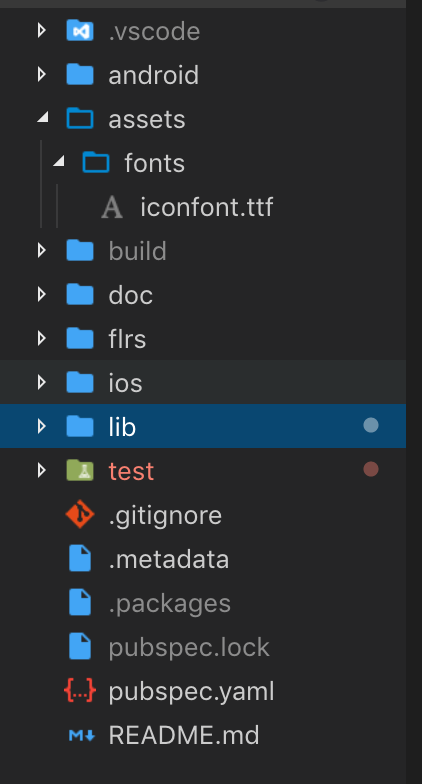

# Flutter IconFont 的引用

> 效果如下


我们这里面采用的是[阿里矢量图形库](https://www.iconfont.cn "矢量图")

- 1.先去网站搜索图标,添加到购物车


- 2.在购物车中[下载代码]或者添加到项目中下载代码

> 购物车下载


> 项目中下载


- 3.下载完成打开 zip 包


- 4.将标注的 ttf 文件移动到 flutter 根目录 assets 下面 fonts 文件夹



- 5.`pubspec.yaml`中添加

```dart
  fonts:
      - family: IconFont
        fonts:
          - asset: assets/fonts/iconfont.ttf
```

- 到这一步基本工作已经完成,可以使用了

```dart
child: Icon(
    IconData(0xe64d, fontFamily: 'IconFont'),
    size: 40,
    color: Colors.red,
)
```
这里面做一些说明:打开刚刚的zip包里面的html文件,会显示你下载的图标


`fontFamily`对应的是你在`pubspec.yaml`的`family`的名字

 <Vssue title="flutter-iconfont" />
