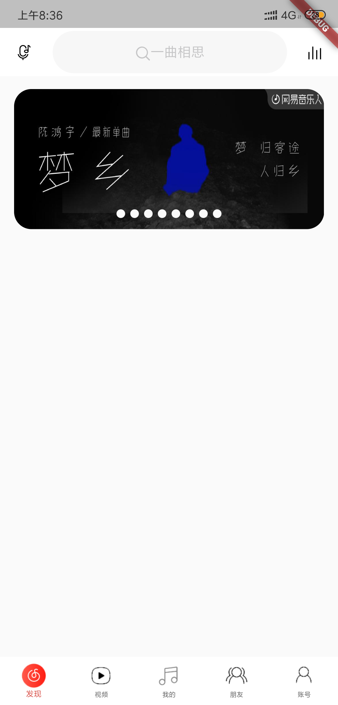

# 杂乱问题收集

## 图片圆边角

图片圆角不能像 web 端一样,元素外面包裹,设置外面元素的圆角实现!



```dart
child: ClipRRect(
    borderRadius: BorderRadius.circular(20),
    child: FadeInImage.assetNetwork(
      placeholder: 'images/plac.png',
      image: '${SwiperList[index]['imageUrl']}',
      fit: BoxFit.fill,
    ),
  )
```

## 登录页键盘弹出页面溢出警告

```dart
Scaffold(
     resizeToAvoidBottomInset: false,
     backgroundColor: Colors.white,
     body: _buildVerticalLayout()
);
```

## 好用的占位图

- 默认效果http://temp.im/ + 尺寸

```
http://temp.im/640x260
```

- 背景色 http://temp.im/ + 尺寸 + 背景色

```
http://temp.im/640x260/ccc
```

- 字体颜色 http://temp.im/ + 尺寸 + 背景色 +字体颜色

```
http://temp.im/640x260/ff5a5f/fff
```

## 解决 FutureBuilder 重复请求的问题

```dart {9,14,47-51}
class SongListPage extends StatefulWidget {
  final String songListId;
  SongListPage(this.songListId);
  @override
  _SongListPageState createState() => _SongListPageState();
}

class _SongListPageState extends State<SongListPage> {
  AsyncMemoizer _memoizer = AsyncMemoizer();
  @override
  Widget build(BuildContext context) {
    return Scaffold(
      body: FutureBuilder(
        future: _getDetail(context),
        builder: (context, snapshot) {
          if (snapshot.connectionState != ConnectionState.waiting) {
            return NestedScrollView(
              headerSliverBuilder: _sliverBuilder,
              body: BottomList(),
            );
          } else {
            return Scaffold(
              appBar: AppBar(
                title: Text(''),
                elevation: 0,
              ),
              body: Center(
                child: Text('数据加载中!'),
              ),
            );
          }
        },
      ),
    );
  }

  List<Widget> _sliverBuilder(BuildContext context, bool innerBoxIsScrolled) {
    return <Widget>[
      TopArea()
    ];
  }

  _getDetail(BuildContext context) {
    return _memoizer.runOnce(() async {
      return await Provider.of<SongDetailProvider>(context)
          .getSongDetail(widget.songListId);
    });
  }
}
```

<Vssue title="flutter-other" />
