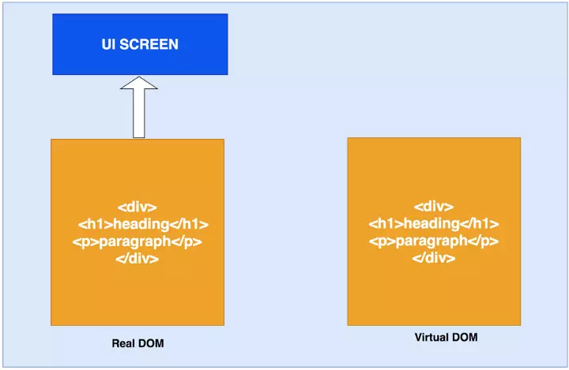
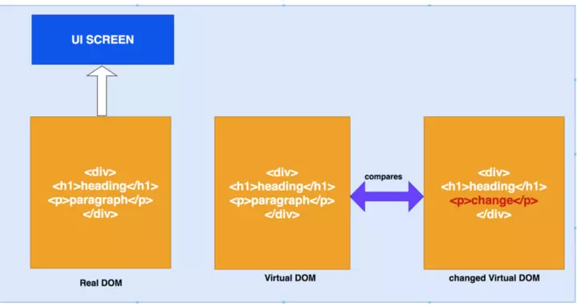
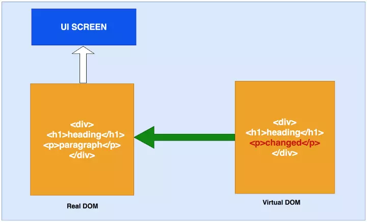
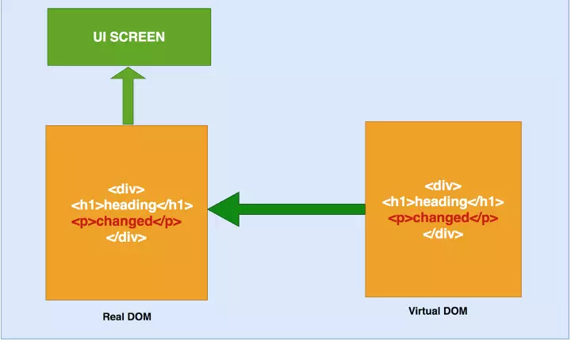
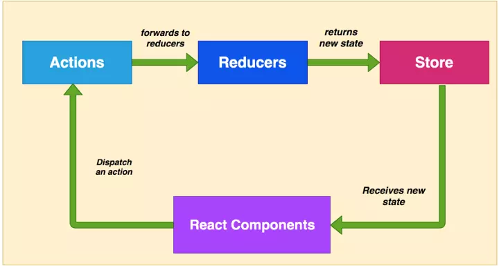
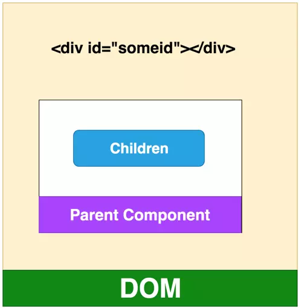
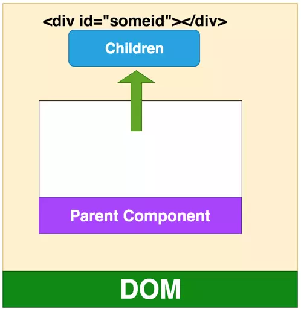

# React
## 什么是声明式编程
声明式编程是一种编程范式,它关注的是你要做什么,而不是如何做.它表达逻辑而不显式地定义步骤.这意味着我们需要根据逻辑的计算来声明要显示的组件.它没有描述控制流步骤.声明式编程的例子有HTML、SQL等.

## 声明式编程 vs 命令式编程
声明式编程的编写方式描述了应该做什么,而命令式编程描述了如何做.在声明式编程中,让编译器决定如何做事情.声明性程序很容易推理,因为代码本身描述了它在做什么.

下面是一个例子,数组中的每个元素都乘以 2,我们使用声明式map函数,让编译器来完成其余的工作,而使用命令式,需要编写所有的流程步骤.
```js
const numbers = [1,2,3,4,5];

// 声明式
const doubleWithDec = numbers.map(number => number * 2);

console.log(doubleWithDec)

// 命令式
const doubleWithImp = [];
for(let i=0; i<numbers.length; i++) {
    const numberdouble = numbers[i] * 2;
    doubleWithImp.push(numberdouble)
}

console.log(doubleWithImp)
```

## 什么是函数式编程
函数式编程是声明式编程的一部分.javascript中的函数是第一类公民,这意味着函数是数据,你可以像保存变量一样在应用程序中保存、检索和传递这些函数.

函数式编程有些核心的概念,如下：

- 不可变性(Immutability)
- 纯函数(Pure Functions)
- 数据转换(Data Transformations)
- 高阶函数 (Higher-Order Functions)
- 递归
- 组合

### 不可变性(Immutability)
不可变性意味着不可改变. 在函数式编程中,你无法更改数据,也不能更改. 如果要改变或更改数据,则必须复制数据副本来更改.

例如,这是一个student对象和changeName函数,如果要更改学生的名称,则需要先复制 student 对象,然后返回新对象.

在javascript中,函数参数是对实际数据的引用,你不应该使用 student.firstName =“testing11”,这会改变实际的student 对象,应该使用Object.assign复制对象并返回新对象.

```js
let student = {
    firstName: "testing",
    lastName: "testing",
    marks: 500
}

function changeName(student) {
    // student.firstName = "testing11" //should not do it
    let copiedStudent = Object.assign({}, student);
    copiedStudent.firstName = "testing11";
    return copiedStudent;
}

console.log(changeName(student));

console.log(student);
```

### 纯函数
纯函数是始终接受一个或多个参数并计算参数并返回数据或函数的函数. 它没有副作用,例如设置全局状态,更改应用程序状态,它总是将参数视为不可变数据.

我想使用 appendAddress 的函数向student对象添加一个地址. 如果使用非纯函数,它没有参数,直接更改 student 对象来更改全局状态.

使用纯函数,它接受参数,基于参数计算,返回一个新对象而不修改参数.
```js
let student = {
    firstName: "testing",
    lastName: "testing",
    marks: 500
}

// 非纯函数
function appendAddress() {
    student.address = {streetNumber:"0000", streetName: "first", city:"somecity"};
}

console.log(appendAddress());

// 纯函数
function appendAddress(student) {
    let copystudent = Object.assign({}, student);
    copystudent.address = {streetNumber:"0000", streetName: "first", city:"somecity"};
    return copystudent;
}

console.log(appendAddress(student));

console.log(student);
```

### 数据转换
我们讲了很多关于不可变性的内容,如果数据是不可变的,我们如何改变数据.如上所述,我们总是生成原始数据的转换副本,而不是直接更改原始数据.

再介绍一些 javascript内置函数,当然还有很多其他的函数,这里有一些例子.所有这些函数都不改变现有的数据,而是返回新的数组或对象.
```js
let cities = ["irving", "lowell", "houston"];

// we can get the comma separated list
console.log(cities.join(','))
// irving,lowell,houston

// if we want to get cities start with i
const citiesI = cities.filter(city => city[0] === "i");
console.log(citiesI)
// [ 'irving' ]

// if we want to capitalize all the cities
const citiesC = cities.map(city => city.toUpperCase());
console.log(citiesC)
// [ 'IRVING', 'LOWELL', 'HOUSTON' ]
```

### 高阶函数
高阶函数是将函数作为参数或返回函数的函数,或者有时它们都有. 这些高阶函数可以操纵其他函数.

Array.map,Array.filter和Array.reduce是高阶函数,因为它们将函数作为参数.
```js
const numbers = [10,20,40,50,60,70,80]

const out1 = numbers.map(num => num * 100);
console.log(out1);
// [ 1000, 2000, 4000, 5000, 6000, 7000, 8000 ]

const out2 = numbers.filter(num => num > 50);
console.log(out2);
// [ 60, 70, 80 ]

const out3 = numbers.reduce((out,num) => out + num);
console.log(out3);
// 330
```
下面是另一个名为isPersonOld的高阶函数示例,该函数接受另外两个函数,分别是 message和isYoung.
```js
const isYoung = age => age < 25;

const message = msg => "He is "+ msg;

function isPersonOld(age, isYoung, message) {
    const returnMessage = isYoung(age)?message("young"):message("old");
    return returnMessage;
}

// passing functions as an arguments
console.log(isPersonOld(13,isYoung,message))
// He is young
```

### 递归
递归是一种函数在满足一定条件之前调用自身的技术.只要可能,最好使用递归而不是循环.你必须注意这一点,浏览器不能处理太多递归和抛出错误.

下面是一个演示递归的例子,在这个递归中,打印一个类似于楼梯的名称.我们也可以使用for循环,但只要可能,我们更喜欢递归.
```js
function printMyName(name, count) {
    if(count <= name.length) {
        console.log(name.substring(0,count));
        printMyName(name, ++count);
    }
}

console.log(printMyName("Bhargav", 1));

/*
B
Bh
Bha
Bhar
Bharg
Bharga
Bhargav
*/

// withotu recursion
var name = "Bhargav"
var output = "";
for(let i=0; i<name.length; i++) {
    output = output + name[i];
    console.log(output);
}
```

### 组合
在React中,我们将功能划分为小型可重用的纯函数,我们必须将所有这些可重用的函数放在一起,最终使其成为产品. 将所有较小的函数组合成更大的函数,最终,得到一个应用程序,这称为组合.

实现组合有许多不同方法. 我们从Javascript中了解到的一种常见方法是链接. 链接是一种使用点表示法调用前一个函数的返回值的函数的方法.

这是一个例子. 我们有一个name,如果firstName和lastName大于5个单词的大写字母,刚返回,并且打印名称的名称和长度.
```js
const name = "Bhargav Bachina";

const output = name.split(" ")
    .filter(name => name.length > 5)
    .map(val => {
    val = val.toUpperCase();
    console.log("Name:::::"+val);
    console.log("Count::::"+val.length);
    return val;
});

console.log(output)
/*
Name:::::BHARGAV
Count::::7
Name:::::BACHINA
Count::::7
[ 'BHARGAV', 'BACHINA' ]
*/
```
在React中,我们使用了不同于链接的方法,因为如果有30个这样的函数,就很难进行链接.这里的目的是将所有更简单的函数组合起来生成一个更高阶的函数.
```js
const name = compose(
    splitmyName,
    countEachName,
    comvertUpperCase,
    returnName
)

console.log(name);
```

## 什么是 React
React是一个简单的javascript UI库,用于构建高效、快速的用户界面.它是一个轻量级库,因此很受欢迎.它遵循组件设计模式、声明式编程范式和函数式编程概念,以使前端应用程序更高效.它使用虚拟DOM来有效地操作DOM.它遵循从高阶组件到低阶组件的单向数据流.

## React 与 Angular 有何不同？
Angular是一个成熟的MVC框架,带有很多特定的特性,比如服务、指令、模板、模块、解析器等等.React是一个非常轻量级的库,它只关注MVC的视图部分.

Angular遵循两个方向的数据流,而React遵循从上到下的单向数据流.React在开发特性时给了开发人员很大的自由,例如,调用API的方式、路由等等.我们不需要包括路由器库,除非我们需要它在我们的项目.

## 什么是Virtual DOM及其工作原理
React 使用 Virtual DOM 来更新真正的 DOM,从而提高效率和速度. 我们来详细讨论这些.

### 什么是Virtual DOM
浏览器遵循HTML指令来构造文档对象模型(DOM).当浏览器加载HTML并呈现用户界面时,HTML文档中的所有元素都变成DOM元素.

DOM是从根元素开始的元素层次结构.例如,看看下面的HTML.
```js
<div>
    <div>
        <h1>This is heading</h1>
        <p>this is paragraph</p>
        <div>
            <p>This is just a paragraon</p>
        </div>
    </div>
    <div>
        <h1>This is heading</h1>
        <p>this is paragraph</p>
        <div>
            <p>This is just a paragraon</p>
        </div>
    </div>
    <div>
        <h1>This is heading</h1>
        <p>this is paragraph</p>
        <div>
            <p>This is just a paragraon</p>
        </div>
    </div>
</div>
```
当涉及到SPA应用程序时,首次加载index.html,并在index.html本身中加载更新后的数据或另一个html.当用户浏览站点时,我们使用新内容更新相同的index.html.每当DOM发生更改时,浏览器都需要重新计算CSS、进行布局并重新绘制web页面.

React 使用 Virtual DOM 有效地重建 DOM.对于我们来说,这使得DOM操作的一项非常复杂和耗时的任务变得更加容易.React从开发人员那里抽象出所有这些,以便在Virtual DOM的帮助下构建高效的UI.

### 虚拟DOM是如何工作的
虚拟DOM只不过是真实 DOM 的 javascript对象表示. 与更新真实 DOM 相比,更新 javascript 对象更容易,更快捷. 考虑到这一点,让我们看看它是如何工作的.

React将整个DOM副本保存为虚拟DOM

每当有更新时,它都会维护两个虚拟DOM,以比较之前的状态和当前状态,并确定哪些对象已被更改. 例如,段落文本更改为更改.

现在,它通过比较两个虚拟DOM 差异,并将这些变化更新到实际DOM

一旦真正的DOM更新,它也会更新UI


## 什么是 JSX
JSX是javascript的语法扩展.它就像一个拥有javascript全部功能的模板语言.它生成React元素,这些元素将在DOM中呈现.React建议在组件使用JSX.在JSX中,我们结合了javascript和HTML,并生成了可以在DOM中呈现的react元素.

下面是JSX的一个例子.我们可以看到如何将javascript和HTML结合起来.如果HTML中包含任何动态变量,我们应该使用表达式{}.
```js
import React from 'react';

export const Header = () => {

    const heading = 'TODO App'

    return(
        <div style={{backgroundColor:'orange'}}>
            <h1>{heading}</h1>
        </div>
    )
}
```

## 组件和不同类型
React 中一切都是组件.我们通常将应用程序的整个逻辑分解为小的单个部分.我们将每个单独的部分称为组件.通常,组件是一个javascript函数,它接受输入,处理它并返回在UI中呈现的React元素.

在React中有不同类型的组件.让我们详细看看.

### 函数/无状态/展示组件
函数或无状态组件是一个纯函数,它可接受接受参数,并返回react元素.这些都是没有任何副作用的纯函数.这些组件没有状态或生命周期方法,这里有一个例子.
```js
import React from 'react';
import Jumbotron from 'react-bootstrap/Jumbotron';

export const Header = () => {
    return(
        <Jumbotron style={{backgroundColor:'orange'}}>
            <h1>TODO App</h1>
        </Jumbotron>
    )
}
```
### 类/有状态组件
类或有状态组件具有状态和生命周期方可能通过setState()方法更改组件的状态.类组件是通过扩展React创建的.它在构造函数中初始化,也可能有子组件,这里有一个例子.
```js
import React from 'react';
import '../App.css';
import { ToDoForm } from './todoform';
import { ToDolist } from './todolist';

export class Dashboard extends React.Component {

  constructor(props){
    super(props);

    this.state = {

    }
  }
  
  render() {
    return (
      <div className="dashboard"> 
          <ToDoForm />
          <ToDolist />
      </div>
    );
  }
}
```
### 受控组件
受控组件是在 React 中处理输入表单的一种技术.表单元素通常维护它们自己的状态,而react则在组件的状态属性中维护状态.我们可以将两者结合起来控制输入表单.这称为受控组件.因此,在受控组件表单中,数据由React组件处理.

这里有一个例子.当用户在 todo 项中输入名称时,调用一个javascript函数handleChange捕捉每个输入的数据并将其放入状态,这样就在 handleSubmit中的使用数据.
```js
import React from 'react';
import Form from 'react-bootstrap/Form';
import Button from 'react-bootstrap/Button';
import Row from 'react-bootstrap/Row';
import Col from 'react-bootstrap/Col';

export class ToDoForm extends React.Component {
    constructor(props) {
      super(props);
      this.state = {value: ''};
  
      this.handleChange = this.handleChange.bind(this);
      this.handleSubmit = this.handleSubmit.bind(this);
    }
  
    handleChange(event) {
      this.setState({value: event.target.value});
    }
  
    handleSubmit(event) {
      alert('A name was submitted: ' + this.state.value);
      event.preventDefault();
    }
  
    render() {
      return (
          <div className="todoform">
            <Form>
                <Form.Group as={Row} controlId="formHorizontalEmail">
                    <Form.Label column sm={2}>
                    <span className="item">Item</span>
                    </Form.Label>
                    <Col sm={5}>
                        <Form.Control type="text" placeholder="Todo Item" />
                    </Col>
                    <Col sm={5}>
                        <Button variant="primary" type="submit">Add</Button>
                    </Col>
                </Form.Group>
            </Form>
         </div>
      );
    }
  }

```
### 非受控组件
大多数情况下,建议使用受控组件.有一种称为非受控组件的方法可以通过使用Ref来处理表单数据.在非受控组件中,Ref用于直接从DOM访问表单值,而不是事件处理程序.

我们使用Ref构建了相同的表单,而不是使用React状态. 我们使用React.createRef() 定义Ref并传递该输入表单并直接从handleSubmit方法中的DOM访问表单值.
```js
import React from 'react';
import Form from 'react-bootstrap/Form';
import Button from 'react-bootstrap/Button';
import Row from 'react-bootstrap/Row';
import Col from 'react-bootstrap/Col';

export class ToDoForm extends React.Component {
    constructor(props) {
      super(props);
      this.state = {value: ''};
      this.input = React.createRef();
  
      this.handleSubmit = this.handleSubmit.bind(this);
    }
  
    handleSubmit(event) {
      alert('A name was submitted: ' + this.input.current.value);
      event.preventDefault();
    }
  
    render() {
      return (
          <div className="todoform">
            <Form>
                <Form.Group as={Row} controlId="formHorizontalEmail">
                    <Form.Label column sm={2}>
                    <span className="item">Item</span>
                    </Form.Label>
                    <Col sm={5}>
                        <Form.Control type="text" placeholder="Todo Item" ref={this.input}/>
                    </Col>
                    <Col sm={5}>
                        <Button variant="primary" onClick={this.handleSubmit} type="submit">Add</Button>
                    </Col>
                </Form.Group>
            </Form>
         </div>
      );
    }
  }
```
### 容器组件
容器组件是处理获取数据、订阅 redux 存储等的组件.它们包含展示组件和其他容器组件,但是里面从来没有html.
高阶组件.

高阶组件是将组件作为参数并生成另一个组件的组件. Redux connect是高阶组件的示例. 这是一种用于生成可重用组件的强大技术.

## Props 和 State
Props 是只读属性,传递给组件以呈现UI和状态,我们可以随时间更改组件的输出.

下面是一个类组件的示例,它在构造函数中定义了props和state,每当使用this.setState() 修改状态时,将再次调用 render( ) 函数来更改UI中组件的输出.
```js
import React from 'react';
import '../App.css';

export class Dashboard extends React.Component {

  constructor(props){
    super(props);

    this.state = {
        name: "some name"
    }
  }

  render() {

    // reading state
    const name = this.state.name;

    //reading props
    const address = this.props.address;

    return (
      <div className="dashboard"> 
          {name}
          {address}
      </div>
    );
  }
}
```
### 什么是PropTypes
随着时间的推移,应用程序会变得越来越大,因此类型检查非常重要.PropTypes为组件提供类型检查,并为其他开发人员提供很好的文档.如果react项目不使用 Typescript,建议为组件添加 PropTypes.

如果组件没有收到任何 props,我们还可以为每个组件定义要显示的默认 props.这里有一个例子.UserDisplay有三个 prop:name、address和age,我们正在为它们定义默认的props 和 prop类型.
```js
import React from 'react';
import PropTypes from 'prop-types';

export const UserDisplay = ({name, address, age}) => {

    UserDisplay.defaultProps = {
        name: 'myname',
        age: 100,
        address: "0000 onestreet"
    };

    return (
        <>
            <div>
                <div class="label">Name:</div>
                <div>{name}</div>
            </div>
            <div>
                <div class="label">Address:</div>
                <div>{address}</div>
            </div>
            <div>
                <div class="label">Age:</div>
                <div>{age}</div>
            </div>
        </>
    )
}

UserDisplay.propTypes = {
    name: PropTypes.string.isRequired,
    address: PropTypes.objectOf(PropTypes.string),
    age: PropTypes.number.isRequired
}
```
## 如何更新状态以及如何不更新
你不应该直接修改状态.可以在构造函数中定义状态值.直接使用状态不会触发重新渲染.React 使用this.setState()时合并状态.
```js
//  错误方式
this.state.name = "some name"
//  正确方式
this.setState({name:"some name"})
```
使用this.setState()的第二种形式总是更安全的,因为更新的props和状态是异步的.这里,我们根据这些 props 更新状态.
```js
// 错误方式
this.setState({
    timesVisited: this.state.timesVisited + this.props.count
})
// 正确方式
this.setState((state, props) => {
    timesVisited: state.timesVisited + props.count
});
```
## 组件生命周期方法
组件在进入和离开DOM时要经历一系列生命周期方法,下面是这些生命周期方法.

componentWillMount()

在渲染前调用,在客户端也在服务端,它只发生一次.

componentDidMount()

在第一次渲染后调用,只在客户端.之后组件已经生成了对应的DOM结构,可以通过this.getDOMNode()来进行访问. 如果你想和其他JavaScript框架一起使用,可以在这个方法中调用setTimeout, setInterval或者发送AJAX请求等操作(防止异部操作阻塞UI).

componentWillReceiveProps()

在组件接收到一个新的 prop (更新后)时被调用.这个方法在初始化render时不会被调用.

shouldComponentUpdate()

返回一个布尔值.在组件接收到新的props或者state时被调用.在初始化时或者使用forceUpdate时不被调用. 可以在你确认不需要更新组件时使用.

componentWillUpdate()

在组件接收到新的props或者state但还没有render时被调用.在初始化时不会被调用.

componentDidUpdate()

在组件完成更新后立即调用.在初始化时不会被调用.

componentWillUnMount()

组件从 DOM 中移除的时候立刻被调用.

getDerivedStateFromError()

这个生命周期方法在ErrorBoundary类中使用.实际上,如果使用这个生命周期方法,任何类都会变成ErrorBoundary.这用于在组件树中出现错误时呈现回退UI,而不是在屏幕上显示一些奇怪的错误.

componentDidCatch()

这个生命周期方法在ErrorBoundary类中使用.实际上,如果使用这个生命周期方法,任何类都会变成ErrorBoundary.这用于在组件树中出现错误时记录错误.

## 超越继承的组合
在React中,我们总是使用组合而不是继承.我们已经在函数式编程部分讨论了什么是组合.这是一种结合简单的可重用函数来生成高阶组件的技术.下面是一个组合的例子,我们在 dashboard 组件中使用两个小组件todoForm和todoList.
```js
import React from 'react';
import '../App.css';
import { ToDoForm } from './todoform';
import { ToDolist } from './todolist';

export class Dashboard extends React.Component {

  render() {
    return (
      <div className="dashboard"> 
          <ToDoForm />
          <ToDolist />
      </div>
    );
  }
}
```
## 如何在React中应用样式
将样式应用于React组件有三种方法.
### 外部样式表
在此方法中,你可以将外部样式表导入到组件使用类中. 但是你应该使用className而不是class来为React元素应用样式, 这里有一个例子.
```js
import React from 'react';
import './App.css';
import { Header } from './header/header';
import { Footer } from './footer/footer';
import { Dashboard } from './dashboard/dashboard';
import { UserDisplay } from './userdisplay';

function App() {
  return (
    <div className="App">
      <Header />
      <Dashboard />
      <UserDisplay />
      <Footer />
    </div>
  );
}

export default App;
```
### 内联样式
在这个方法中,我们可以直接将 props 传递给HTML元素,属性为style.这里有一个例子.这里需要注意的重要一点是,我们将javascript对象传递给style,这就是为什么我们使用 backgroundColor 而不是CSS方法backbackground -color
```js
import React from 'react';

export const Header = () => {

    const heading = 'TODO App'

    return(
        <div style={{backgroundColor:'orange'}}>
            <h1>{heading}</h1>
        </div>
    )
}
```
### 定义样式对象并使用它
因为我们将javascript对象传递给style属性,所以我们可以在组件中定义一个style对象并使用它.下面是一个示例,你也可以将此对象作为 props 传递到组件树中.
```js
import React from 'react';

const footerStyle = {
    width: '100%',
    backgroundColor: 'green',
    padding: '50px',
    font: '30px',
    color: 'white',
    fontWeight: 'bold'
}

export const Footer = () => {
    return(
        <div style={footerStyle}>
            All Rights Reserved 2019
        </div>
    )
}
```
## 什么是Redux及其工作原理
Redux 是 React的一个状态管理库,它基于flux.Redux简化了React中的单向数据流.Redux将状态管理完全从React中抽象出来.
### 它是如何工作的
在React中,组件连接到 redux ,如果要访问 redux,需要派出一个包含 id和负载(payload) 的 action.action 中的 payload 是可选的,action 将其转发给 Reducer.
当reducer收到action时,通过 swithc...case 语法比较 action 中type. 匹配时,更新对应的内容返回新的 state.
当Redux状态更改时,连接到Redux的组件将接收新的状态作为props.当组件接收到这些props时,它将进入更新阶段并重新渲染 UI.



### Redux 循环细节
让我们详细看看整个redux 循环细节.

Action: Action 只是一个简单的json对象,type 和有payload作为键.type 是必须要有的,payload是可选的.下面是一个 action 的例子.

```js
// action

{ 
  type:"SEND_EMAIL", 
  payload: data
};
```
Action Creators：这些是创建Actions的函数,因此我们在派发action时不必在组件中手动编写每个 action. 以下是 action creator 的示例.
```
// action creator

export function sendEamil(data) {
    return { type:"SEND_EMAIL", payload: data};
}
```
Reducers：Reducers 是纯函数,它将 action和当前 state 作为参数,计算必要的逻辑并返回一个新的state. 这些 Reducers 没有任何副作用. 它不会改变 state 而是总是返回 state.
```js
export default function emailReducer(state = [], action){
 
  switch(action.type) {
      case "SEND_EMAIL":  return Object.assign({}, state, {
       email: action.payload
      });
      default: return state;
  }
}
```
### 组件如何与 redux 进行连接
mapStateToProps：此函数将state映射到 props 上,因此只要state发生变化,新 state 会重新映射到 props. 这是订阅store的方式.
mapDispatchToProps：此函数用于将 action creators 绑定到你的props.以便我们可以在第12行中使用This. props.actions.sendemail()来派发一个动作.
connect和bindActionCreators来自 redux. 前者用于连接 store ,如第22行,后者用于将 action creators 绑定到你的 props ,如第20行.
```js
// import connect
import { connect } from 'react-redux'
import { bindActionCreators } from 'redux'

// import action creators
import * as userActions from '../../../actions/userActions';

export class User extends React.Component {
  
    handleSubmit() {
        // dispatch an action
        this.props.actions.sendEmail(this.state.email);
    }
  
}

// you are mapping you state props
const mapStateToProps = (state, ownProps) => ({user: state.user})
// you are binding your action creators to your props
const mapDispatchToProps = (dispatch) => ({actions: bindActionCreators(userActions, dispatch)})

export default connect(mapStateToProps, mapDispatchToProps)(User);
```
## 什么是 React Router Dom 及其工作原理
react-router-dom是应用程序中路由的库. React库中没有路由功能,需要单独安装react-router-dom.

react-router-dom 提供两个路由器BrowserRouter和HashRoauter.前者基于url的pathname段,后者基于hash段.
```js
 前者：http://127.0.0.1:3000/article/num1

 后者：http://127.0.0.1:3000/#/article/num1（不一定是这样,但#是少不了的）
```
react-router-dom 组件

- BrowserRouter 和 HashRouter 是路由器.
- Route 用于路由匹配.
- Link 组件用于在应用程序中创建链接. 它将在HTML中渲染为锚标记.
- NavLink是突出显示当前活动链接的特殊链接.
- Switch 不是必需的,但在组合路由时很有用.
- Redirect 用于强制路由重定向
下面是组件中的Link、NavLink和Redirect 的例子
```html
// normal link
<Link to="/gotoA">Home</Link>

// link which highlights currentlu active route with the given class name
<NavLink to="/gotoB" activeClassName="active">
  React
</NavLink>

// you can redirect to this url
<Redirect to="/gotoC" />
```
以下是 react router 组件的示例. 如果你查看下面的示例,我们将匹配路径并使用Switch和Route呈现相应的组件.
```js
import React from 'react'
// import react router DOM elements
import { Switch, Route, Redirect } from 'react-router-dom'
import ComponentA from '../common/compa'
import ComponentB from '../common/compb'
import ComponentC from '../common/compc'
import ComponentD from '../common/compd'
import ComponentE from '../common/compe'


const Layout = ({ match }) => {
    return(
        <div className="">
            <Switch>
                <Route exact path={`${match.path}/gotoA`} component={ComponentA} />
                <Route path={`${match.path}/gotoB`} component={ComponentB} />
                <Route path={`${match.path}/gotoC`} component={ComponentC} />
                <Route path={`${match.path}/gotoD`} component={ComponentD} />
                <Route path={`${match.path}/gotoE`} component={ComponentE} />
            </Switch>
        </div>
    )}

export default Layout
```
## 什么是错误边界
在 React 中,我们通常有一个组件树.如果任何一个组件发生错误,它将破坏整个组件树.没有办法捕捉这些错误,我们可以用错误边界优雅地处理这些错误.
错误边界有两个作用

- 如果发生错误,显示回退UI
- 记录错误

下面是ErrorBoundary类的一个例子.如果类实现了 getDerivedStateFromError或componentDidCatch 这两个生命周期方法的任何一下,,那么这个类就会成为ErrorBoundary.前者返回{hasError: true}来呈现回退UI,后者用于记录错误.

```jsx
import React from 'react'

export class ErrorBoundary extends React.Component {
    constructor(props) {
      super(props);
      this.state = { hasError: false };
    }
  
    static getDerivedStateFromError(error) {
      // Update state so the next render will show the fallback UI.
      return { hasError: true };
    }
  
    componentDidCatch(error, info) {
      // You can also log the error to an error reporting service
      console.log('Error::::', error);
    }
  
    render() {
      if (this.state.hasError) {
        // You can render any custom fallback UI
        return <h1>OOPS!. WE ARE LOOKING INTO IT.</h1>;
      }
  
      return this.props.children; 
    }
  }

```
以下是我们如何在其中一个组件中使用ErrorBoundary.使用ErrorBoundary类包裹 ToDoForm和ToDoList. 如果这些组件中发生任何错误,我们会记录错误并显示回退UI.
```jsx
import React from 'react';
import '../App.css';
import { ToDoForm } from './todoform';
import { ToDolist } from './todolist';
import { ErrorBoundary } from '../errorboundary';

export class Dashboard extends React.Component {

  render() {
    return (
      <div className="dashboard"> 
        <ErrorBoundary>
          <ToDoForm />
          <ToDolist />
        </ErrorBoundary>
      </div>
    );
  }
}
```
## 什么是 Fragments
在React中,我们需要有一个父元素,同时从组件返回React元素.有时在DOM中添加额外的节点会很烦人.使用 Fragments,我们不需要在DOM中添加额外的节点.我们只需要用 React.Fragment 或才简写 <> 来包裹内容就行了.如下 所示：
```jsx
 // Without Fragments   
return (
    <div>
       <CompoentA />
       <CompoentB />
       <CompoentC />
    </div>
)

// With Fragments   
  return (
    <React.Fragment>
       <CompoentA />
       <CompoentB />
       <CompoentC />
    </React.Fragment>
  )

  // shorthand notation Fragments   
  return (
    <>
       <CompoentA />
       <CompoentB />
       <CompoentC />
    </>
  )
```
## 什么是传送门(Portals)
默认情况下,所有子组件都在UI上呈现,具体取决于组件层次结构.Portal 提供了一种将子节点渲染到存在于父组件以外的 DOM 节点的优秀的方案.

这里有一个例子.默认情况下,父组件在DOM层次结构中有子组件.


我们可以将 children 组件移出parent 组件并将其附加 id 为 someid 的 Dom 节点下.
首先,获取 id 为 someid,我们在constructor中创建一个元素div,将child附加到componentDidMount中的someRoot.最后,我们在ReactDOM.createPortal（this.props.childen）,domnode的帮助下将子节点传递给该特定DOM节点.

首先,先获取 id 为someid DOM元素,接着在构造函数中创建一个元素div,在 componentDidMount方法中将 someRoot 放到 div 中. 最后,通过
ReactDOM.createPortal(this.props.childen), domnode)将 children 传递到对应的节点下.
```jsx
const someRoot = document.getElementById('someid');

class Modal extends React.Component {
  constructor(props) {
    super(props);
    this.el = document.createElement('div');
  }

  componentDidMount() {
    someRoot.appendChild(this.el);
  }

  componentWillUnmount() {
    someRoot.removeChild(this.el);
  }

  render() {
    return ReactDOM.createPortal(
      this.props.children,
      this.el,
    );
  }
}
```


## 什么是上下文
有时我们必须将props 传递给组件树,即使所有中间组件都不需要这些props.上下文是一种传递props 的方法,而不用在每一层传递组件树.

## 什么是 Hooks
Hooks 是React版本16.8中的新功能.请记住,我们不能在函数组件中使用state ,因为它们不是类组件.Hooks 让我们在函数组件中可以使用state 和其他功能.

目前没有重大变化,我们不必放弃类组件.

Hook 不会影响你对 React 概念的理解. 恰恰相反,Hook 为已知的 React 概念提供了更直接的 API：props, state,context,refs 以及生命周期.稍后我们将看到,Hook 还提供了一种更强大的方式来组合他们.

我们可以使用一些钩子,例如useState,useEffect,useContext,useReducer等.

下面是 Hooks 的基本规则

- Hooks 应该在外层使用,不应该在循环,条件或嵌套函数中使用
- Hooks 应该只在函数组件中使用.

让我们看一个例子来理解 hooks. 这是一个函数组件,它采用props并在UI上显示这些props. 在useState钩子的帮助下,我们将这个函数组件转换为有状态组件.首先,我们在第5行定义状态,这相当于
```jsx
constructor(props) {
 super(props);
 this.state = {
     name:'myname', age:10, address:'0000 one street'
 }
}
```
useState返回两个项,一个是user,另一个是setUser函数. user 是一个可以在没有 this关键字的情况下直接使用的对象,setUser是一个可以用来设置用户点击第21行按钮的状态的函数,该函数等效于以下内容.
```jsx
this.setState({name:'name changed'})
```
```jsx
import React, { useState } from "react";

export const UserDisplay = ({ name, address, age }) => {
    const [user, setUser] = useState({
        name: "myname",
        age: 10,
        address: "0000 onestreet"
    });

    return (
        <>
            <div>
                <div class="label">Name:</div>
                <div>{user.name}</div>
            </div>
            <div>
                <div class="label">Address:</div>
                <div>{user.address}</div>
            </div>
            <div>
                <div class="label">Age:</div>
                <div>{user.age}</div>
            </div>
            <button onClick={() => setUser({ name: "name changed" })}>
                Click me
            </button>
        </>
    );
};
```
## 如何提高性能
我们可以通过多种方式提高应用性能,以下这些比较重要：

- 适当地使用shouldComponentUpdate生命周期方法. 它避免了子组件的不必要的渲染. 如果树中有100个组件,则不重新渲染整个组件树来提高应用程序性能.
- 使用create-react-app来构建项目,这会创建整个项目结构,并进行大量优化.
- 不可变性是提高性能的关键.不要对数据进行修改,而是始终在现有集合的基础上创建新的集合,以保持尽可能少的复制,从而提高性能.
- 在显示列表或表格时始终使用 Keys,这会让 React 的更新速度更快.
- 代码分离是将代码插入到单独的文件中,只加载模块或部分所需的文件的技术.

## 如何在重新加载页面时保留数据
单页应用程序首先在DOM中加载index.html,然后在用户浏览页面时加载内容,或者从同一index.html中的后端API获取任何数据.

如果通过点击浏览器中的重新加载按钮重新加载页面index.html,整个React应用程序将重新加载,我们将丢失应用程序的状态.如何保留应用状态？

每当重新加载应用程序时,我们使用浏览器localstorage来保存应用程序的状态.我们将整个存储数据保存在localstorage中,每当有页面刷新或重新加载时,我们从localstorage加载状态.


## 如何在React进行API调用
我们使用redux-thunk在React中调用API.因为reduce是纯函数,所以没有副作用,比如调用API.

因此,我们必须使用redux-thunk从 action creators 那里进行 API 调用.Action creator 派发一个action,将来自API的数据放入action 的 payload 中.Reducers 接收我们在上面的redux循环中讨论的数据,其余的过程也是相同的.

redux-thunk是一个中间件.一旦它被引入到项目中,每次派发一个action时,都会通过thunk传递.如果它是一个函数,它只是等待函数处理并返回响应.如果它不是一个函数,它只是正常处理.

这里有一个例子.sendEmailAPI是从组件中调用的函数,它接受一个数据并返回一个函数,其中dispatch作为参数.我们使用redux-thunk调用API apiservice,并等待收到响应.一旦接收到响应,我们就使用payload 派发一个action.
```jsx
import apiservice from '../services/apiservice';

export function sendEmail(data) {
    return { type:"SEND_EMAIL", payload: data };
}

export function sendEmailAPI(email) {
    return function(dispatch) {
        return apiservice.callAPI(email).then(data => {
            dispatch(sendEmail(data));
        });
    }
}
```
 <Vssue title="interview-react" />


