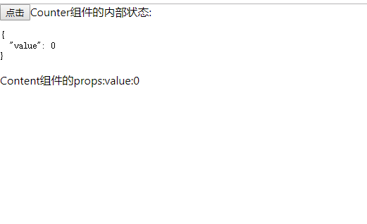
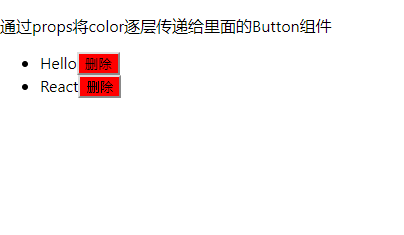

# props
::: tip
 props是React中很重要的一个概念,使用props向React组件传递数据,React组件从props中取出数据,然后返回视图
:::
## 验证props
数据类型验证
- 1.JavaScript基本数据类型,包括数组,布尔,函数,数字,对象,字符串
```
    React.PropType.array

    React.PropType.bool

    React.PropType.func

    React.PropType.number

    React.PropType.object

    React.PropType.string

```
- 2.可以被渲染为子节点的对象,包括数组,字符串,ReactElement(指jsx闭合标签)或数组
```
React.PropType.node
```
- 3.ReactElement
```
React.PropType.element
```
- 4.指定类的实例
```
React.PropType.instanceOf(Message)
```
- 5.只接受指定的值
```
React.PropType.oneOf(["News","Photos])
```
- 6.多个对象类型中的一个
```
React.PropType.oneOfType([
    React.PropType.string,
    React.PropType.number,
    React.PropType.instanceOf(Message)
])
```
- 7.指定类型组成的数组
```
React.PropType.arrayOf(React.PropType.number)
```
- 8.指定类型的属性构成的对象
```
React.PropType.objectOf(React.PropType.number)
```
- 9.符合指定格式的对象
```
React.PropType.shape(
    color:React.PropType.string,
    fontSize:React.PropType.number
)
```
- 10.任意类型加上isRequire使其不可为空
```
React.PropType.func.isRequired
```
- 11.自定义验证器,如果验证失败了需要返回一个Error对象.不要直接使用conosle.error或抛异常,因为这样的话oneOfType会失效
```
function(props,propName,componentName){
    if(!/matchme/.test(props[propName])){
        return new Error("Validation failed!")
    }
}
```
## 组合使用props和state
使用Counter组件更新state的value,然后将更新的state.value通过props传递给Content组件


```
import React, {
    Component
} from 'react'
import PropTypes from 'prop-types';

function Content(props){
    return <p>Content组件的props:value:{props.value}</p>
}
Content.propTypes = {
    value: PropTypes.number.isRequired
};

export default class Counter extends Component{
    constructor(){
        super()
        this.state={value:0}
    }
    render(){
        return(
            <div>
                < button onClick = {
                    () => this.setState({
                        value: this.state.value + 1
                    })
                } >
                    点击
                </button>
                Counter组件的内部状态:
                <pre>{JSON.stringify(this.state,null,2)}</pre>
                <Content value={this.state.value}/>
            </div>
        )
    }
}
```
## props传递数据
MessageList=>Message=>Button


```
import React from 'react'
import PropTypes from 'prop-types';
// 按钮
function Button(props){
    return(
        <button style={{background:props.color}}>
            {props.children}
        </button>
    )
}
Button.propType={
    color:PropTypes.string.isRequired,
    children:PropTypes.string.isRequired
}

// 消息
function Message(props){
    return(
        <li>
            {props.text}<Button color={props.color}>删除</Button>
        </li>
    )
}
Message.propType={
    text:PropTypes.string.isRequired,
    color:PropTypes.string.isRequired
}
// 列表
function MessageList(){
    const color="red"
    const messages=[
        {text:"Hello"},
        {text:"React"}
    ]
    const children=messages.map((message,key)=>
        <Message key={key} text={message.text} color={color}/>
    );
    return(
        <div>
            <p>
                通过props将color逐层传递给里面的Button组件
            </p>
            <ul>
                {children}
            </ul>
        </div>
    )
}
export default MessageList;
```

通过getChildContext()方法将color放在context中,并声明了childContxtTypes,如果不声明chilContextTypes,将无法在组件中使用getChildContext()方法

:::tip

1.state内部状态或者局部状态

2.Props与context则用于组件之间传递数据,使用props传递数据简单清晰,但是跨级传递非常麻烦,使用context可以跨级传递数据,但是降低组件的复用性,因为这些组件依赖上下文,所以近况使用context传递登陆的状态,颜色主题等全局数据
:::
 <Vssue title="props" />
